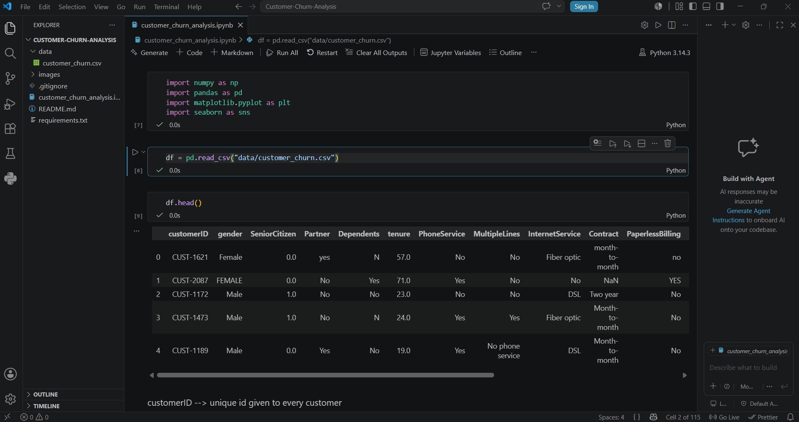
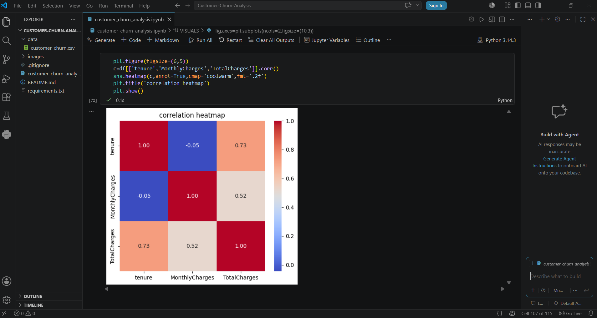
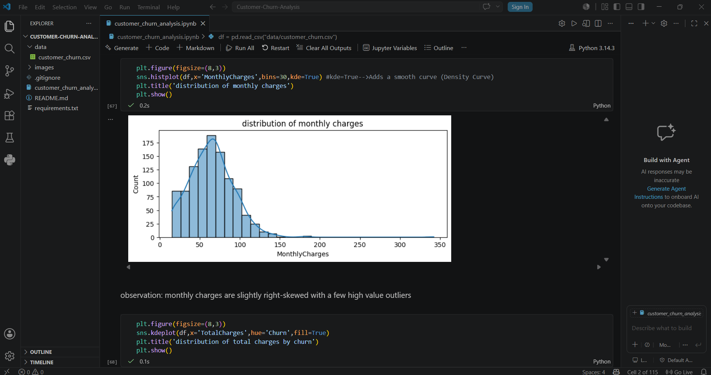
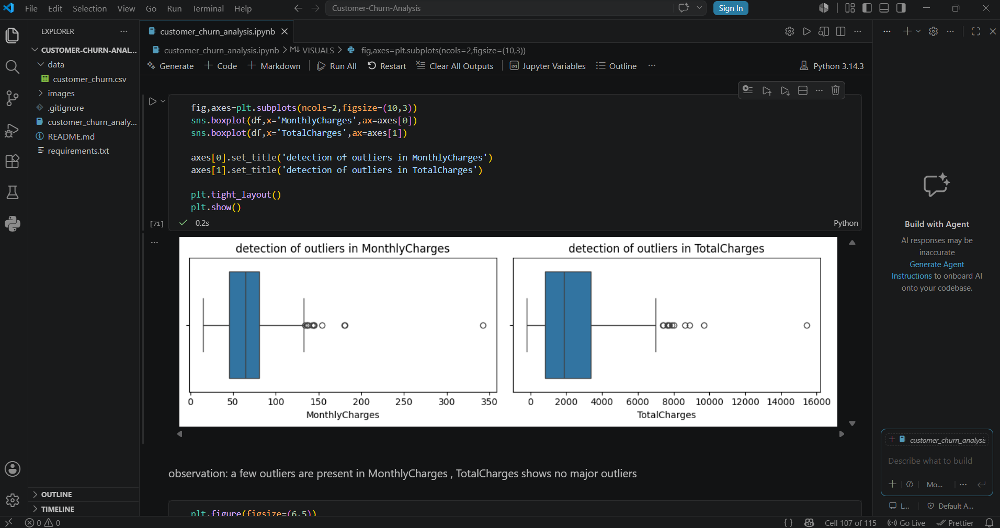
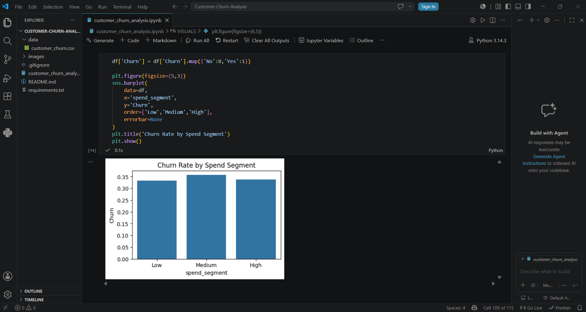
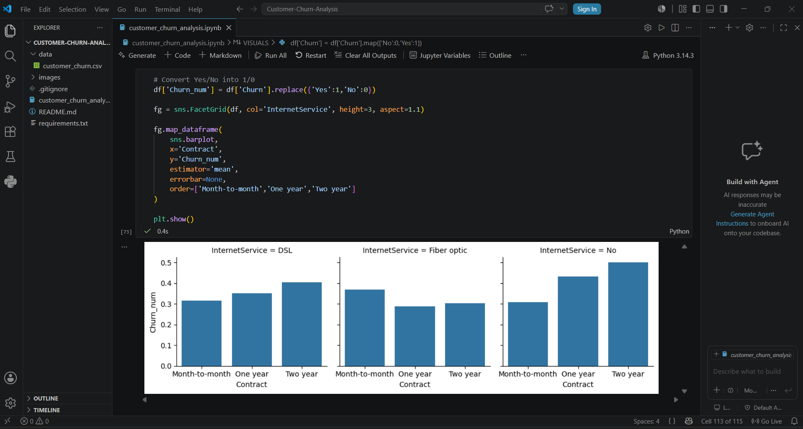

# 📊 Customer Churn Analysis

## 📌 Project Overview

Customer churn is one of the biggest challenges faced by businesses. This project analyzes customer data to identify the factors that influence customer churn using Python and Exploratory Data Analysis (EDA).

The project involves data cleaning, preprocessing, visualization, and extracting meaningful business insights that can help organizations improve customer retention.

---

## 🎯 Objectives

- Analyze customer churn behavior.
- Perform data cleaning and preprocessing.
- Explore relationships between different customer features.
- Visualize important trends using charts and graphs.
- Generate business insights from the data.

---

## 🛠️ Technologies Used

- Python
- Jupyter Notebook
- Pandas
- NumPy
- Matplotlib
- Seaborn

---

## 📂 Project Structure

```
Customer-Churn-Analysis/
│
├── data/
│   └── customer_churn.csv
│
├── images/
│   ├── dataset_preview.png
│   ├── correlation_heatmap.png
│   ├── monthly_charges_distribution.png
│   ├── monthly_total_charges_boxplots.png
│   ├── churn_rate_by_spend_segment.png
│   └── internet_service_analysis.png
│
├── customer_churn_analysis.ipynb
├── requirements.txt
├── README.md
└── .gitignore
```

---

## 📊 Dataset Preview



---

## 📈 Data Visualizations

### Correlation Heatmap



---

### Monthly Charges Distribution



---

### Monthly & Total Charges Boxplots



---

### Churn Rate by Spend Segment



---

### Internet Service Analysis



---

## 📌 Key Insights

- Customers with higher monthly charges tend to churn more frequently.
- Contract type has a significant impact on customer retention.
- Spend segments show different churn patterns.
- Outlier detection helped identify unusual billing behavior.
- Correlation analysis highlights relationships between numerical features.

---

## ▶️ How to Run the Project

1. Clone this repository.
2. Install the required libraries.

```
pip install -r requirements.txt
```

3. Open the notebook.

```
jupyter notebook customer_churn_analysis.ipynb
```

4. Run all cells.

---

## 📧 Author

**Anushka Saha**

B.Tech Computer Science Engineering

Aspiring Data Analyst | Python | SQL | Power BI | Machine Learning
